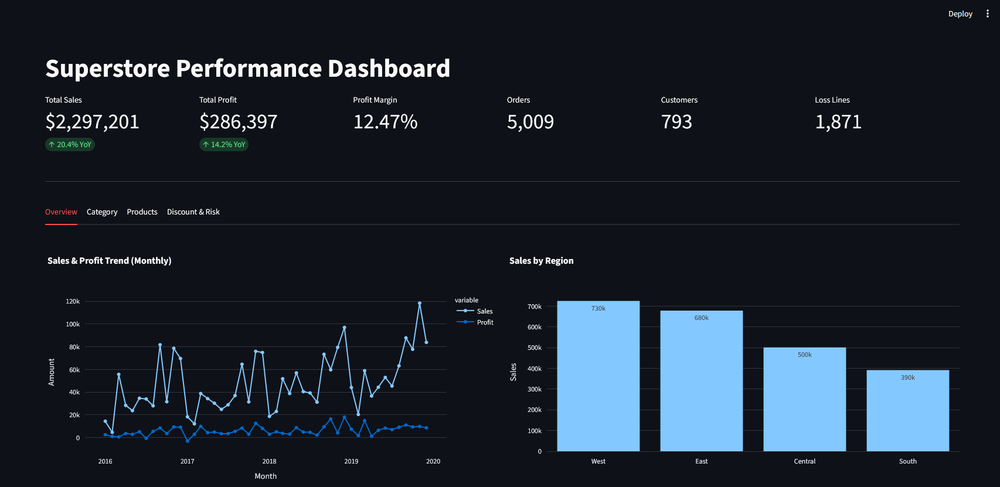
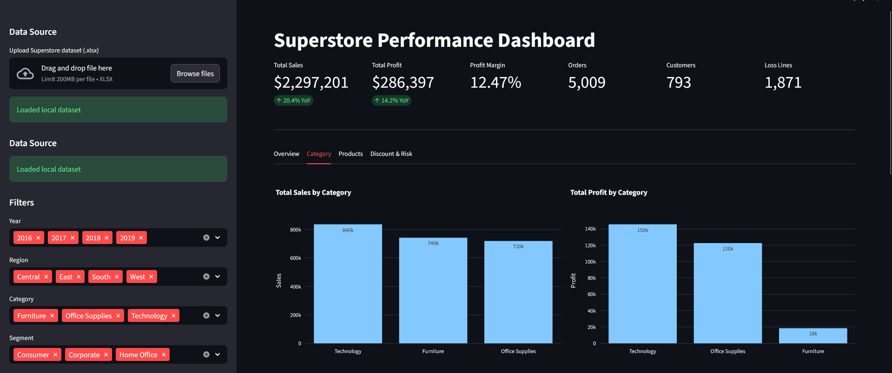
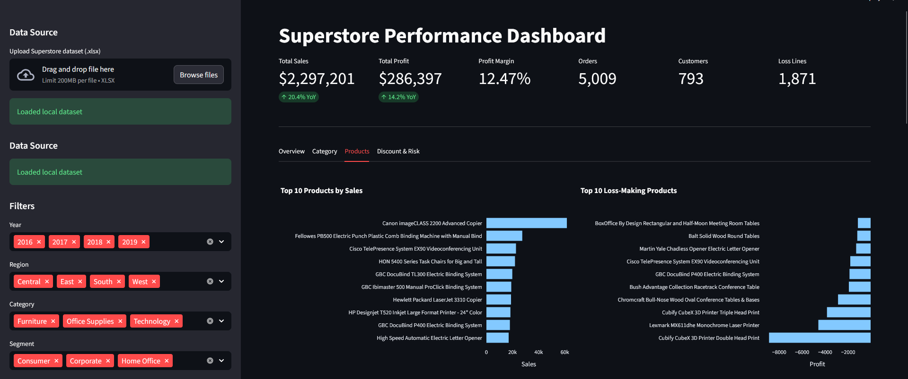
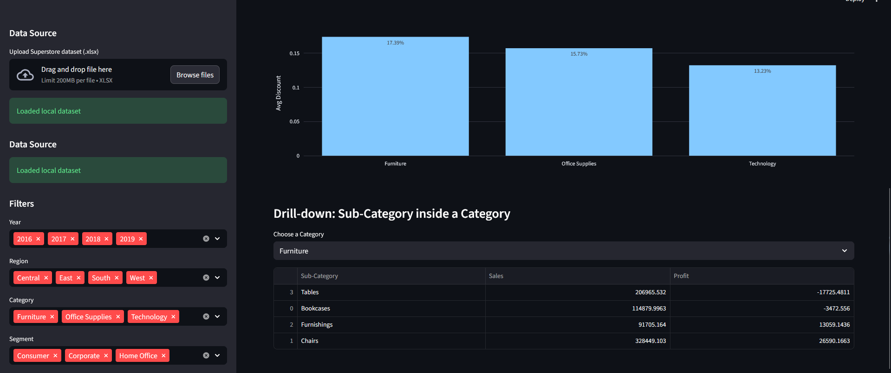

# Superstore Performance Dashboard

An interactive **Business Intelligence dashboard** built with **Python and Streamlit** to analyze sales performance for a retail superstore dataset.

The project explores sales trends, profitability, product performance, and discount impact through **Exploratory Data Analysis (EDA)** and an **interactive dashboard**.

---

## Project Overview

This project demonstrates a full data analysis workflow:

1. **Data Understanding**
2. **Exploratory Data Analysis (EDA)**
3. **Data Preparation**
4. **Dashboard Development**
5. **Business Insights**

The dashboard allows users to interactively explore the data using filters and visualize key business metrics.

---

## Dashboard Features

* Interactive filters for:

  * Year
  * Region
  * Category
  * Segment

* Key Performance Indicators (KPIs):

  * Total Sales
  * Total Profit
  * Profit Margin
  * Number of Orders
  * Number of Customers
  * Loss-making transactions

* Visual Analysis:

  * Sales & Profit Trend (Monthly)
  * Sales by Region
  * Top Products by Sales
  * Loss-making Products
  * Discount vs Profit Analysis

* Automated Executive Insights

* Download filtered dataset as CSV

---

## Project Structure

```
superstore-2019-python-dashboard
│
├── app.py
├── requirements.txt
├── README.md
├── project_progress_report.md
│
├── src
│   ├── data.py
│   ├── metrics.py
│   └── charts.py
│
├── notebooks
│   ├── 01_data_understanding.ipynb
│   └── 02_dashboard_preparation.ipynb
│
└── data
    └── raw
```

---

## Analysis Notebooks

* **01_data_understanding.ipynb**
  Exploratory Data Analysis and dataset inspection.

* **02_dashboard_preparation.ipynb**
  Data cleaning and preparation steps used before building the dashboard.

---

## Dashboard Preview

### Overview


### Category Analysis


### Products Analysis


### Discount & Risk


## Installation

Clone the repository:

```bash
git clone https://github.com/abokamal87/superstore-2019-python-dashboard.git
cd superstore-2019-python-dashboard
```

Install dependencies:

```bash
pip install -r requirements.txt
```

---

## Running the Dashboard

Start the Streamlit app:

```bash
streamlit run app.py
```

---

## Dataset

This project uses the **Superstore Sales Dataset**.

Place the dataset file in:

```
data/raw/
```

Example file name:

```
Sample - Superstore 2019.xlsx
```

Alternatively, the dataset can be uploaded directly through the dashboard interface.

---

## Technologies Used

* Python
* Pandas
* Streamlit
* Plotly
* Git & GitHub
* Jupyter Notebook

---

## Author

**Mohamed Kamal**

Data Analyst | Python | SQL | Power BI | Data Visualization
